<p align="center">
  
</p>

<h1 align="center">Cognivue</h1>

<p align="center">
  <strong>A Privacy-First, On-Device Cognitive Intelligence & Productivity Analytics Platform</strong>
</p>

<p align="center">
  
  
  
  
  
  
  
  
  
  
</p>

---

## 1. Project Introduction

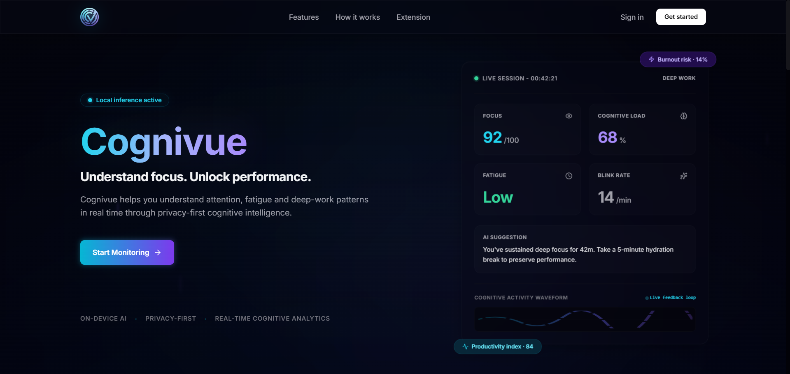
> **Landing Page:** Cognivue focuses on providing users with deep biometric analytics without sacrificing data privacy, ensuring all heavy computation runs strictly on the local client.

Modern knowledge work demands intense, sustained focus. Yet, the tools we use to track our productivity are fundamentally flawed. 

## 2. The Problem & Why Existing Solutions Fall Short

Traditional productivity tools fall into two distinct paradigms, both with significant engineering and ethical shortcomings:

1. **Superficial Timers:** Basic stopwatches (like Pomodoro apps) track elapsed time but have zero contextual awareness. They do not know if the user is actually focused on a complex problem or mindlessly staring at a wall experiencing cognitive fatigue.
2. **Invasive Bossware:** Corporate spyware takes the opposite extreme. These platforms upload full-resolution screenshots, log raw DOM keystrokes, and record webcam streams to the cloud. This violates user privacy, creates massive data liability, and consumes significant network bandwidth.

## 3. Why Cognivue

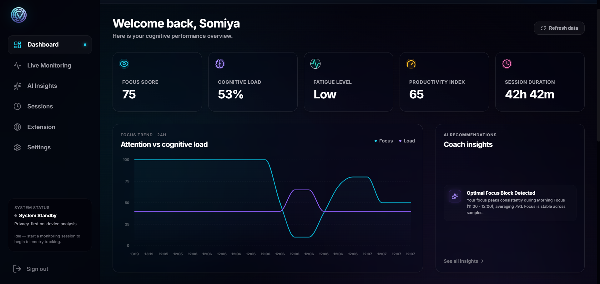
> **Dashboard Overview:** A centralized hub providing real-time cognitive metrics aggregated from local computer vision models and extension telemetry.

**Cognivue** was engineered to solve this dichotomy. It provides deep, biometric analytics—such as gaze tracking, blink-rate analysis, and posture drift—to measure genuine cognitive focus. Crucially, it accomplishes this entirely **on-device**. By utilizing WebAssembly (via MediaPipe) to sandbox computer vision models directly within the browser, raw video frames never leave the user's machine.

## 4. Engineering Goals

- **Local Inference:** All facial landmark detection and mathematical modeling must happen on the client machine.
- **Privacy-First Telemetry:** The backend should only ever receive anonymized scalar values (e.g., `focus_score: 85`), never raw images, base64 strings, or DOM content.
- **Low Latency UI:** Ensure the React dashboard remains completely responsive while continuously processing native 30 FPS webcam streams.
- **Decoupled Architecture:** Strictly separate the browser monitoring extension from the computer vision client and the analytics backend.

---

## 5. System Architecture

The architecture of Cognivue is a distributed system consisting of decoupled components that communicate asynchronously.

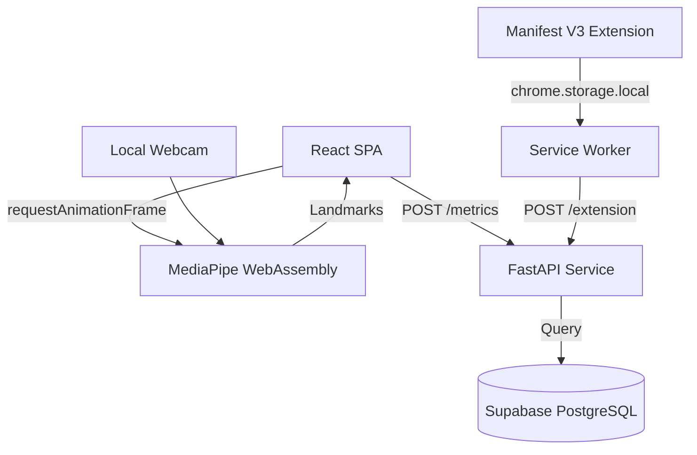

### Component Breakdown
- **React SPA:** Hosts the MediaPipe FaceMesh model. It renders the webcam stream to an off-screen `<video>` element, calculates focus heuristics locally, and maintains state.
- **Chrome Extension:** A Manifest V3 background service worker that polls the active tab's domain and categorizes it using static rules.
- **FastAPI Backend:** A high-performance Python REST API that ingests time-series telemetry from both the React SPA and the Extension, aggregating it into unified user sessions.
- **Supabase Database:** Persists telemetry data and strictly utilizes Row-Level Security (RLS) to ensure users can only query their own session records.

## 6. How Data Flows

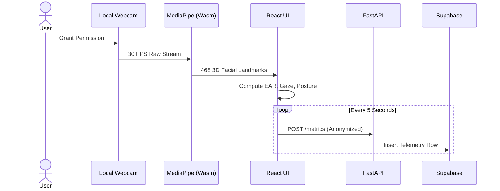

---

## 7. Privacy Architecture

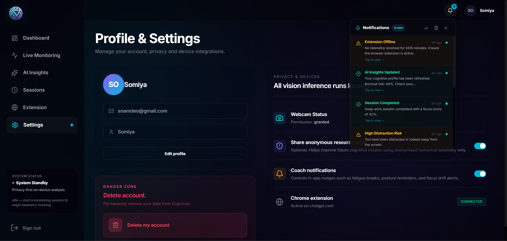
> **Security & Privacy Settings:** Users maintain complete control over their data, reinforcing the zero-image telemetry guarantee.

Cognivue guarantees privacy through an absolute isolation boundary between local memory and the network layer. 
- **Raw Frames:** Captured via `navigator.mediaDevices.getUserMedia` directly into the DOM.
- **Zero-Image Guarantee:** No frame buffer or base64 image string is ever serialized into an HTTP request.
- **Sanitized Values:** Only integers and Enums (`focus_score = 85`, `gaze_status = 'On Screen'`) cross the network boundary to the FastAPI backend.

## 8. AI Pipeline & Live Monitoring

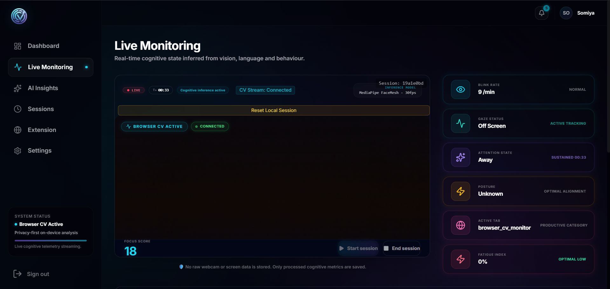
> **Live Computer Vision Monitor:** Real-time feedback loop processing 468 facial landmarks. The UI overlays focus, posture, and blink-rate heuristics dynamically without sending video data to the cloud.

The computer vision pipeline distills raw landmarks into actionable heuristics:

1. **Facial Landmarks:** 468 spatial coordinates mapped to the user's face in real-time.
2. **Blink Detection:** Computes the Eye Aspect Ratio (EAR) between eyelid coordinates. It calibrates a baseline over the first 30 frames. A drop below 72% of this baseline registers as a blink.
3. **Gaze Estimation:** If the face bounding box remains undetected for >1.5 seconds, gaze seamlessly shifts to `Off Screen`.
4. **Fatigue Score:** Increases dynamically if the smoothed blink rate exceeds 25 blinks/min or if the average EAR remains critically low.
5. **Focus Score:** A capped integer (0-100). If fatigue crosses 80%, the maximum possible focus score is artificially capped at 65, mathematically reflecting human cognitive limits.

## 9. Browser Extension

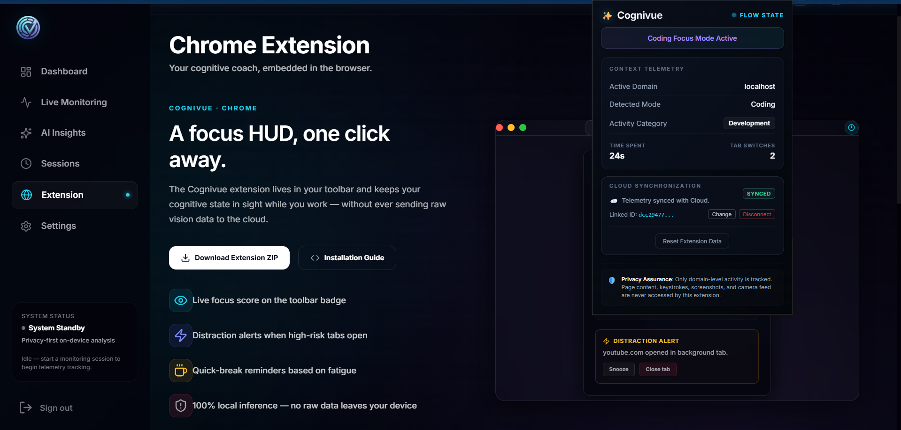
> **Manifest V3 Extension:** Lightweight background domain tracker that correlates web activity with cognitive state.

The Manifest V3 extension avoids invasive DOM injection (Content Scripts are minimal/non-existent for tracking).
- **Domain Polling:** The background service worker listens to `chrome.tabs.onActivated` and `chrome.tabs.onUpdated` to extract only the URL hostname.
- **Telemetry Sync:** The extension maintains its own HTTP connection to the FastAPI backend, bypassing the React frontend. This allows tracking to continue robustly even if the React dashboard is closed.

---

## 10. Database & Session History

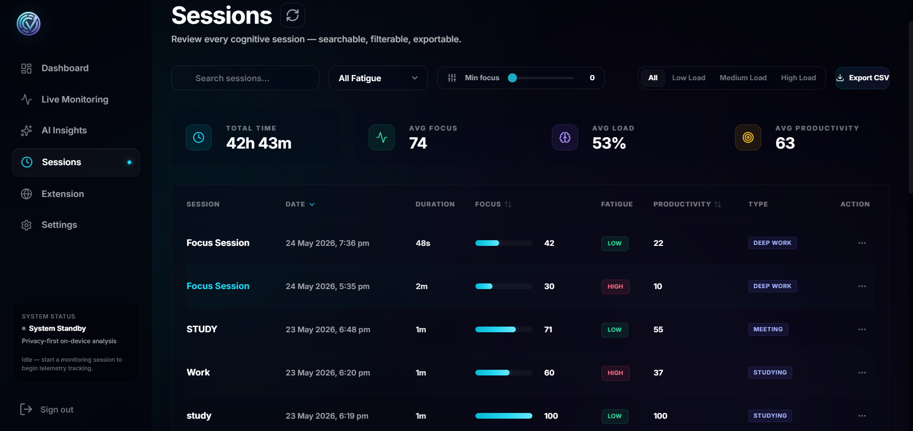
> **Session History Log:** Deep work blocks are queried from Supabase and aggregated, showing productivity trends over time.

The backend exposes RESTful endpoints and utilizes Supabase (PostgreSQL) for persistence. The database strictly enforces tenant isolation.

| Table | Primary Responsibility | Row-Level Security Strategy |
|-------|------------------------|-----------------------------|
| `users` | Auth mapping and profile state. | `auth.uid() == id` |
| `sessions` | Start/end timestamps for deep work blocks. | `auth.uid() == user_id` |
| `telemetry_metrics`| Time-series logs of focus, fatigue, and posture. | `auth.uid() == user_id` |
| `extension_activity`| Time-series logs of domain usage. | `auth.uid() == user_id` |

---

## 11. Engineering Challenges

### Challenge 1: Main Thread UI Stuttering
- **Problem:** Running MediaPipe FaceMesh at 30 FPS inside a React component caused severe UI stuttering, as state updates triggered React re-renders on every frame.
- **Why it happened:** Storing frame-by-frame metrics (like `focus_score`) in React `useState` hooks forced the entire DOM tree to reconcile 30 times a second.
- **Solution:** Moved all high-frequency computer vision state into mutable `useRef` objects. The `requestAnimationFrame` loop updates the refs directly without triggering React renders. A separate `setInterval` hook polls the refs every 5 seconds to send telemetry to the backend.
- **Outcome:** The dashboard maintains a smooth 60 FPS while the CV model processes at native webcam speeds.

### Challenge 2: Blink Detection Stability in Variable Lighting
- **Problem:** In low-light conditions, the webcam feed became noisy, causing the Eye Aspect Ratio (EAR) calculation to fluctuate rapidly, resulting in false-positive "blinks."
- **Why it happened:** A hardcoded EAR threshold (e.g., `< 0.2`) failed when users sat at different distances from the camera or under shadows.
- **Solution:** Implemented dynamic baseline calibration. For the first 30 frames of a session, the app calculates an average EAR. A blink is only registered if the current EAR drops below 72% of that specific session's baseline, combined with a temporal hysteresis lock (preventing double-counting within 200ms).
- **Outcome:** Significantly reduced false positives across diverse lighting environments.

### Challenge 3: Extension Background Service Worker Sleeping
- **Problem:** The Manifest V3 Chrome extension would stop tracking domains after the user left the browser idle.
- **Why it happened:** Manifest V3 strictly enforces service worker lifecycles, terminating background scripts after ~5 minutes of inactivity to save RAM.
- **Solution:** Relied heavily on `chrome.storage.local` to persist the active domain state and start times. When the worker wakes up via `chrome.tabs.onUpdated` events, it reconstructs the elapsed time accurately from persistent storage rather than relying on volatile in-memory variables.
- **Outcome:** Reliable, battery-friendly domain tracking that easily survives worker terminations.

---

## 12. AI Insights Generation

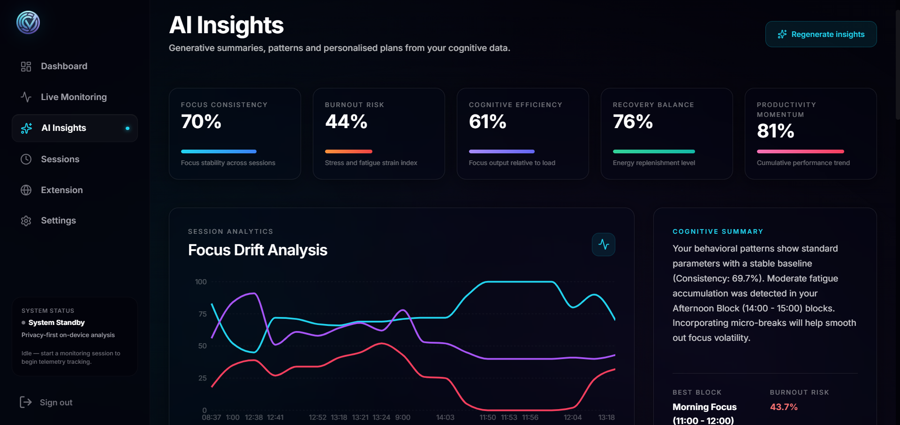
> **AI Insights Overview:** Synthesizing telemetry and domain logs into high-level behavioral patterns.

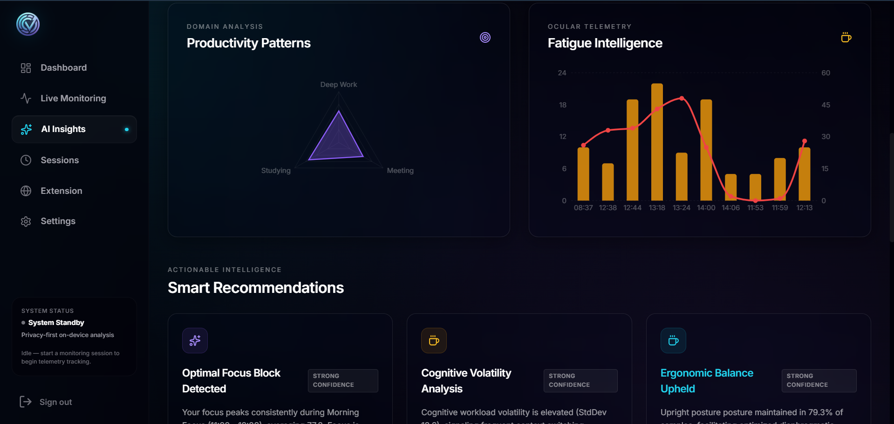
> **Cognitive Analytics Graphs:** Transforming raw `telemetry_metrics` rows into dynamic visual representations of focus over time.

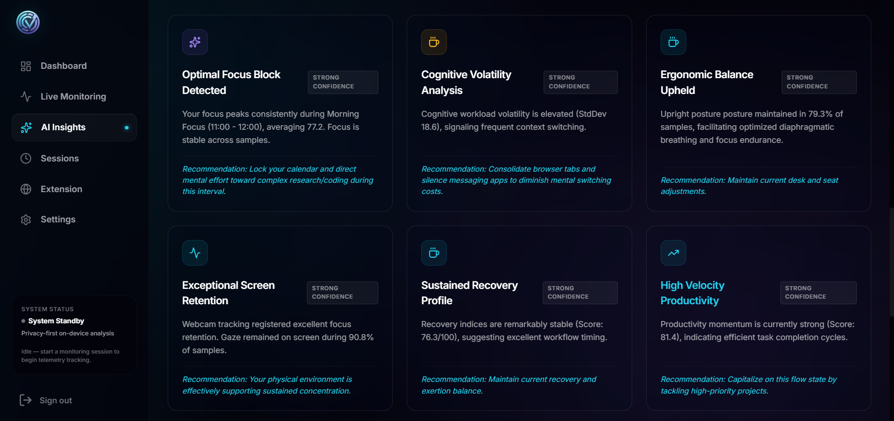
> **Actionable Recommendations:** Generating localized feedback to help prevent burnout and optimize deep work sessions.

---

## 13. Performance & Security

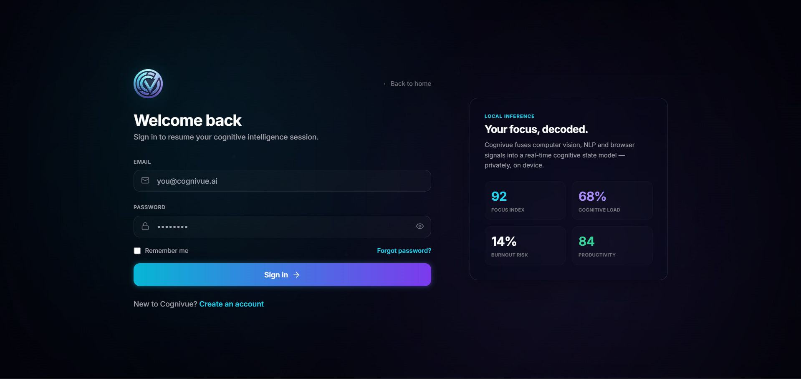
> **Authentication Flow:** Secure JWT-based entry point leveraging Supabase Auth.

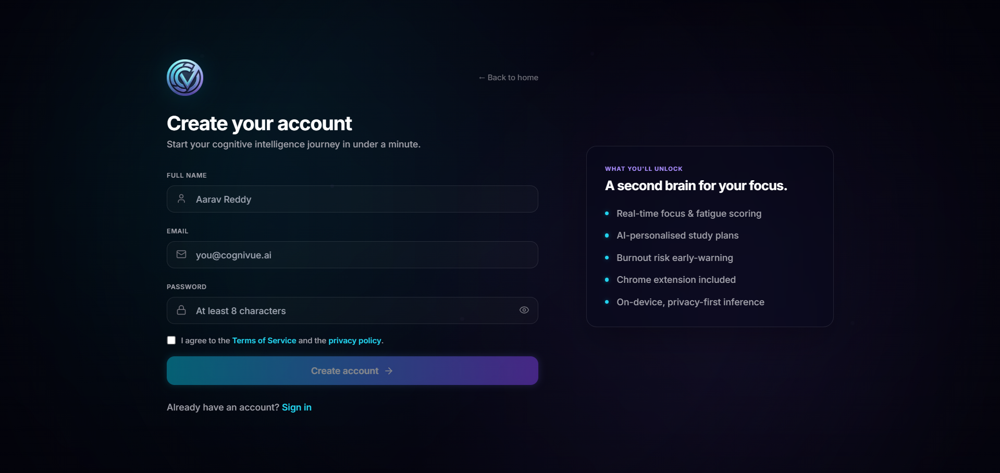
> **Registration:** Creating a distinct tenant boundary for new users.

- **JWT Verification:** FastAPI validates the cryptographic signature of the Supabase-issued JWT via custom middleware before accepting any telemetry payloads.
- **Pydantic Validation:** The backend utilizes strictly typed Pydantic schemas, ensuring malformed telemetry payloads are rejected at the edge.
- **Extension Sandbox:** The Chrome extension operates strictly on the `tabs` permission to read URLs. It deliberately excludes `<all_urls>` host permissions and content scripts, ensuring it physically cannot scrape sensitive DOM content (e.g., passwords or private messages).

---

## 14. Project Limitations
- **Browser Bound:** MediaPipe execution is limited by the V8 JavaScript engine's WebAssembly performance, which inherently consumes more CPU than a native OS desktop application written in C++ or Rust.
- **Environmental Constraints:** Severe backlighting or wearing heavy sunglasses will artificially degrade facial landmark tracking confidence.

## 15. Lessons Learned
- **Web Workers vs. Main Thread:** While `requestAnimationFrame` on the main thread was manageable for MediaPipe FaceMesh using `useRef`, moving inference to a dedicated Web Worker (via OffscreenCanvas) would perfectly isolate CPU spikes from UI animations. This is a critical architectural consideration for future front-end heavy ML projects.
- **State Management in Manifest V3:** Designing for ephemeral background scripts requires a completely different mental model than standard Node.js daemons, forcing a strict prioritization of robust `chrome.storage` persistence over local variable state.

## 16. Future Improvements
- **Desktop Daemon:** Porting the extension functionality to a lightweight Rust daemon for cross-browser, OS-level window tracking.
- **Web Worker Offloading:** Refactoring the React computer vision pipeline to execute completely inside a Web Worker, achieving true 0% main thread blocking.

---

## 17. Setup

```bash
# 1. Clone repository
git clone https://github.com/somiya-namdeo/Cognivue.git
cd Cognivue

# 2. Start Backend (Requires Python 3.10+)
cd backend
python -m venv venv
# Windows: .\venv\Scripts\activate | Mac/Linux: source venv/bin/activate
pip install -r requirements.txt
cp .env.example .env # Configure Supabase keys
uvicorn app.main:app --reload

# 3. Start Frontend (Requires Node 18+)
cd ../frontend
npm install
cp .env.example .env
npm run dev

# 4. Extension
# Load the /extension folder as an unpacked extension in chrome://extensions
```

---

## 18. Author
**Somiya Namdeo**
Software Engineer passionate about local-first AI, privacy, and scalable web architectures.
- [Email](mailto:namdeosomiya@gmail.com)
- [LinkedIn](https://www.linkedin.com/in/somiya-namdeo-/)
