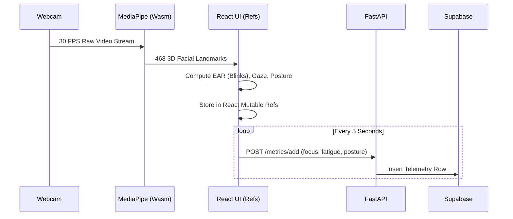

<p align="center">
  
</p>

<h1 align="center">Cognivue</h1>

<p align="center">
  <strong>A Privacy-First, On-Device Cognitive Intelligence & Productivity Analytics Platform</strong>
</p>

<p align="center">
  
  
  
  
  
  
  
  
  
  
</p>

<p align="center">
  <a href="https://github.com/somiya-namdeo/Cognivue"></a>
  <a href="https://www.linkedin.com/in/somiya-namdeo-/"></a>
  <a href="https://cognivue-kappa.vercel.app"></a>
  <a href="https://cognivue-rmlz.onrender.com"></a>
</p>

---

## 1. Why I Built Cognivue
Traditional productivity tools fall into two distinct paradigms, both with significant engineering and ethical shortcomings:
1. **Superficial Timers:** Basic stopwatches (like Pomodoro apps) that track elapsed time but have zero contextual awareness of actual cognitive focus or visual fatigue.
2. **Invasive Bossware:** Corporate spyware that uploads screenshots, logs DOM keystrokes, and records raw webcam streams to the cloud, violating user privacy and creating massive data liability.

**Cognivue** was built to solve this. It provides deep biometric analytics (gaze tracking, blink-rate analysis, posture drift) to measure genuine focus, but it does so entirely **on-device**. By utilizing WebAssembly (via MediaPipe) to sandbox computer vision models within the browser, raw video frames never leave the user's machine.

## 2. Engineering Goals
- **Local Inference:** All facial landmark detection must happen on the client machine.
- **Privacy-First:** The backend should only receive anonymized scalar values (e.g., `focus_score: 85`), never raw images or DOM content.
- **Low Latency UI:** Ensure the React dashboard remains responsive while continuously processing 30 FPS webcam frames.
- **Modular Architecture:** Separate the browser monitoring extension from the computer vision client and the analytics backend.

## 3. Technology Selection

| Technology | Purpose | Reason for Selection | Trade-offs |
|------------|---------|----------------------|------------|
| **React** | Frontend UI | Component-driven architecture easily handles complex, dynamic charting dashboards. | Larger bundle size compared to vanilla JS or Svelte. |
| **FastAPI** | Backend API | High-performance Python framework with built-in Pydantic schema validation. | Requires separate hosting from the frontend, unlike Next.js API routes. |
| **Supabase** | Database & Auth | Managed PostgreSQL with Row-Level Security (RLS) ensures tenant isolation. | Vendor lock-in to Supabase-specific Auth and PostgREST APIs. |
| **MediaPipe** | Computer Vision | Provides a highly accurate 468-point FaceMesh model compiled to WebAssembly. | High CPU utilization on the main thread compared to native OS binaries. |
| **Manifest V3** | Extension API | Modern Chrome extension standard with service workers for background tasks. | Stricter background execution limits require careful telemetry intervals. |

## 4. System Architecture
Cognivue is a distributed system consisting of decoupled components that communicate asynchronously.

```mermaid
graph TD
    subgraph Client [Client-Side (Local Browser)]
        A[React SPA] -->|requestAnimationFrame| B(MediaPipe FaceMesh Wasm)
        C[Webcam] -->|MediaStream| B
        B -->|Landmarks| A
        D[Chrome Extension] -->|chrome.storage| E(Background Service Worker)
    end

    subgraph Backend [Cloud Infrastructure]
        F[FastAPI Service]
        G[(Supabase PostgreSQL)]
    end

    A -->|POST /metrics/add| F
    E -->|POST /extension/activity| F
    F -->|Analytics Queries| G
    F -->|AI Insights Generation| F
```

- **React SPA:** Hosts the MediaPipe FaceMesh model, rendering the webcam stream to an off-screen `<video>` element, and computes focus heuristics locally.
- **Chrome Extension:** A Manifest V3 background service worker that polls the active tab's domain and categorizes it (e.g., Development, Social).
- **FastAPI Backend:** A REST API that ingests time-series telemetry from the React SPA and the Extension, and aggregates it into user sessions.
- **Supabase Database:** Persists telemetry data and utilizes RLS to ensure users can only query their own session records.

## 5. End-to-End Data Flow



## 6. Privacy Pipeline
Cognivue guarantees privacy through an absolute isolation boundary between local memory and the network layer.
- **Raw Frames:** Captured via `navigator.mediaDevices.getUserMedia` directly into the DOM `<video>` tag.
- **Landmarks:** MediaPipe extracts 3D coordinate arrays within the browser's WebAssembly sandbox.
- **Metrics:** React math functions convert coordinates into scalar heuristics (e.g., `eye_open_ratio = 0.28`).
- **Sanitized Values:** Only integers and Enums (`focus_score`, `gaze_status = 'On Screen'`) cross the network boundary to the FastAPI backend.
- **Zero-Image Guarantee:** No frame buffer or base64 image string is ever serialized into an HTTP request.

## 7. Browser Extension Architecture
The Manifest V3 extension avoids invasive DOM injection (Content Scripts are minimal/non-existent for tracking).
- **Domain Polling:** The background service worker listens to `chrome.tabs.onActivated` and `chrome.tabs.onUpdated` to extract only the URL hostname.
- **Categorization:** A static local ruleset maps domains (e.g., `github.com`) to productivity categories (`Development`).
- **Telemetry Sync:** The extension maintains its own HTTP connection to the FastAPI backend, bypassing the React frontend, allowing tracking to continue even if the React dashboard is minimized.

## 8. AI Pipeline
The computer vision pipeline distills raw landmarks into actionable focus scores:
1. **Facial Landmarks:** 468 points mapped to the user's face.
2. **Blink Detection:** Computes the Eye Aspect Ratio (EAR) between eyelid coordinates. Calibrates a baseline over the first 30 frames. A drop below 72% of the baseline registers as a blink.
3. **Gaze Estimation:** If the face bounding box is undetected for >1.5 seconds, gaze shifts to `Off Screen`.
4. **Fatigue Score:** Increases if the smoothed blink rate exceeds 25 blinks/min or if average EAR remains low.
5. **Focus Score:** A capped integer (0-100). If fatigue crosses 80%, the maximum possible focus score is artificially capped at 65, reflecting cognitive limits.

## 9. Database Design (Supabase)
The database enforces tenant isolation using PostgreSQL Row-Level Security (RLS).

| Table | Primary Responsibility | RLS Strategy |
|-------|------------------------|--------------|
| `users` | Auth mapping and profile state. | `auth.uid() == id` |
| `sessions` | Start/end timestamps for deep work blocks. | `auth.uid() == user_id` |
| `telemetry_metrics`| Time-series logs of focus, fatigue, and posture. | `auth.uid() == user_id` |
| `extension_activity`| Time-series logs of domain usage. | `auth.uid() == user_id` |

## 10. Folder Structure

```text
cognivue/
├── frontend/             # React SPA (Vite)
│   ├── src/components/   # UI components (e.g., BrowserCVMonitor.tsx)
│   ├── src/pages/        # Route views
│   └── src/services/     # API fetch wrappers
├── backend/              # Python FastAPI service
│   └── app/
│       ├── database.py   # Supabase client initialization
│       ├── routes/       # API route controllers
│       ├── schemas/      # Pydantic validation models
│       └── services/     # Business logic and database operations
├── extension/            # Chrome Manifest V3 Extension
│   ├── background.js     # Background domain tracking
│   └── manifest.json     # Permissions and configuration
└── docs/                 # Project documentation and screenshots
```

## 11. API Overview
The backend exposes RESTful endpoints grouped by domain:
- **Authentication:** Token validation and user synchronization.
- **Sessions:** `POST /session/start`, `POST /session/end` for managing work blocks.
- **Telemetry:** `POST /metrics/add` (receives 5-second polling data from React).
- **Extension:** `POST /extension/activity` (receives active domain data).
- **Insights:** `GET /insights/daily` (aggregates time-series data into summary statistics).

## 12. Engineering Challenges

### Challenge 1: Main Thread UI Stuttering
- **Problem:** Running MediaPipe FaceMesh at 30 FPS inside a React component caused severe UI stuttering, as state updates triggered React re-renders on every frame.
- **Why it happened:** Storing frame-by-frame metrics (like `focus_score`) in React `useState` hooks forced the entire DOM tree to reconcile 30 times a second.
- **Solution:** Moved all high-frequency computer vision state into mutable `useRef` objects. The `requestAnimationFrame` loop updates the refs directly without triggering React renders. A separate `setInterval` hook polls the refs every 5 seconds to send telemetry to the backend.
- **Trade-offs:** The UI does not instantly reflect millisecond-level changes in focus, but this is acceptable since cognitive state is a macroscopic metric.
- **Outcome:** The dashboard maintains a smooth 60 FPS while the computer vision model processes at native webcam speeds.

### Challenge 2: Blink Detection Stability in Variable Lighting
- **Problem:** In low-light conditions, the webcam feed became noisy, causing the Eye Aspect Ratio (EAR) calculation to fluctuate rapidly. This resulted in false-positive "blinks."
- **Why it happened:** A hardcoded EAR threshold (e.g., `< 0.2`) failed when users sat at different distances from the camera or under shadows.
- **Solution:** Implemented a dynamic baseline calibration. For the first 30 frames of a session, the app calculates an average EAR. A blink is only registered if the current EAR drops below 72% of that specific session's baseline, combined with a temporal hysteresis lock (preventing double-counting within 200ms).
- **Trade-offs:** Requires the user to face the camera neutrally for the first 1-2 seconds of a session.
- **Outcome:** Significantly reduced false positives across different lighting environments.

### Challenge 3: Extension Background Service Worker Sleeping
- **Problem:** The Manifest V3 Chrome extension would stop tracking domains after the user left the browser idle.
- **Why it happened:** Manifest V3 strictly enforces service worker lifecycles, terminating background scripts after ~5 minutes of inactivity to save RAM.
- **Solution:** Relied heavily on `chrome.storage.local` to persist the active domain state and start times. When the worker wakes up via `chrome.tabs.onUpdated` events, it reconstructs the elapsed time accurately from storage rather than relying on in-memory variables.
- **Trade-offs:** Slightly more complex state management and asynchronous storage reads compared to Manifest V2 persistent background pages.
- **Outcome:** Reliable, battery-friendly domain tracking that survives worker terminations.

## 13. Engineering Decisions

- **Why Supabase over standard PostgreSQL + SQLAlchemy?** 
  To reduce backend boilerplate. Supabase provides out-of-the-box JWT authentication and Row-Level Security, allowing the FastAPI backend to act purely as an analytics engine rather than an ORM CRUD wrapper.
- **Why Local Inference over Cloud Vision APIs?**
  Privacy. Sending 30 frames per second to a cloud API (like AWS Rekognition) is prohibitively expensive, introduces severe network latency, and violates user trust by exposing raw biometric feeds.
- **Why Polling Telemetry instead of WebSockets?**
  REST polling every 5 seconds was chosen over WebSockets because focus analytics do not require sub-second real-time delivery to the database. Polling is stateless, handles network drops gracefully, and scales horizontally much easier than maintaining persistent WebSocket connections.

## 14. Performance Considerations
- **Mutable Refs for CV Data:** React `useRef` is used exclusively for 30 FPS inference data to bypass the Virtual DOM reconciliation pipeline entirely.
- **Pydantic Validation:** The FastAPI backend utilizes strictly typed Pydantic schemas, ensuring invalid telemetry payloads are rejected at the edge before hitting the database.
- **Debounced Storage Writes:** The Chrome extension throttles writes to `chrome.storage.local` to prevent I/O bottlenecks during rapid tab switching.

## 15. Security Architecture
- **Row Level Security (RLS):** All database reads and writes enforce `auth.uid() == user_id`, meaning a compromised API endpoint cannot be exploited to leak other users' data.
- **JWT Verification:** FastAPI validates the cryptographic signature of the Supabase-issued JWT via middleware before accepting telemetry payloads.
- **Extension Sandbox:** The Chrome extension operates strictly on the `tabs` permission to read URLs. It deliberately excludes `<all_urls>` host permissions and content scripts, ensuring it cannot scrape sensitive DOM content (e.g., passwords or private messages).

## 16. Project Limitations
- **Browser Bound:** MediaPipe execution is limited by the V8 JavaScript engine's WebAssembly performance, which consumes more CPU than a native OS desktop application.
- **Environmental Constraints:** Severe backlighting or wearing heavy sunglasses will degrade facial landmark tracking confidence.
- **Single-Device Restriction:** Telemetry is currently designed for single-device sessions; parallel sessions on a laptop and a desktop simultaneously are not merged dynamically.

## 17. Lessons Learned
- **Web Workers vs. Main Thread:** While `requestAnimationFrame` on the main thread was manageable for MediaPipe FaceMesh using `useRef`, moving inference to a dedicated Web Worker (OffscreenCanvas) would further isolate CPU spikes from UI animations. This is a critical architectural consideration for future iterations.
- **State Management in Manifest V3:** Designing for ephemeral background scripts requires a completely different mental model than standard Node.js daemons, prioritizing robust persistence over in-memory state.

## 18. Future Roadmap
- **Desktop Daemon:** Porting the extension functionality to a Rust daemon for cross-browser, OS-level window tracking.
- **Web Worker Offloading:** Refactoring the React computer vision pipeline to execute inside a Web Worker to achieve 0% main thread blocking.
- **Enhanced ML Analytics:** Adding localized sentiment analysis heuristics based on facial expression landmarks.

---

## 19. Screenshots
> _Note: Ensure the local development server is running to view live streams._

| Dashboard | AI Insights |
|-----------|-------------|
|  |  |

| Live Monitoring | History |
|-----------------|---------|
|  |  |

## 20. Setup Instructions

```bash
# 1. Clone repository
git clone https://github.com/somiya-namdeo/Cognivue.git
cd Cognivue

# 2. Start Backend (Requires Python 3.10+)
cd backend
python -m venv venv
# Windows: .\venv\Scripts\activate | Mac/Linux: source venv/bin/activate
pip install -r requirements.txt
cp .env.example .env # Configure Supabase keys
uvicorn app.main:app --reload

# 3. Start Frontend (Requires Node 18+)
cd ../frontend
npm install
cp .env.example .env
npm run dev

# 4. Extension
# Load the /extension folder as an unpacked extension in chrome://extensions
```

## 21. Author
**Somiya Namdeo**
Software Engineer passionate about local-first AI, privacy, and scalable web architectures.
- [LinkedIn](https://www.linkedin.com/in/somiya-namdeo-/)
- [Email](mailto:namdeosomiya@gmail.com)
